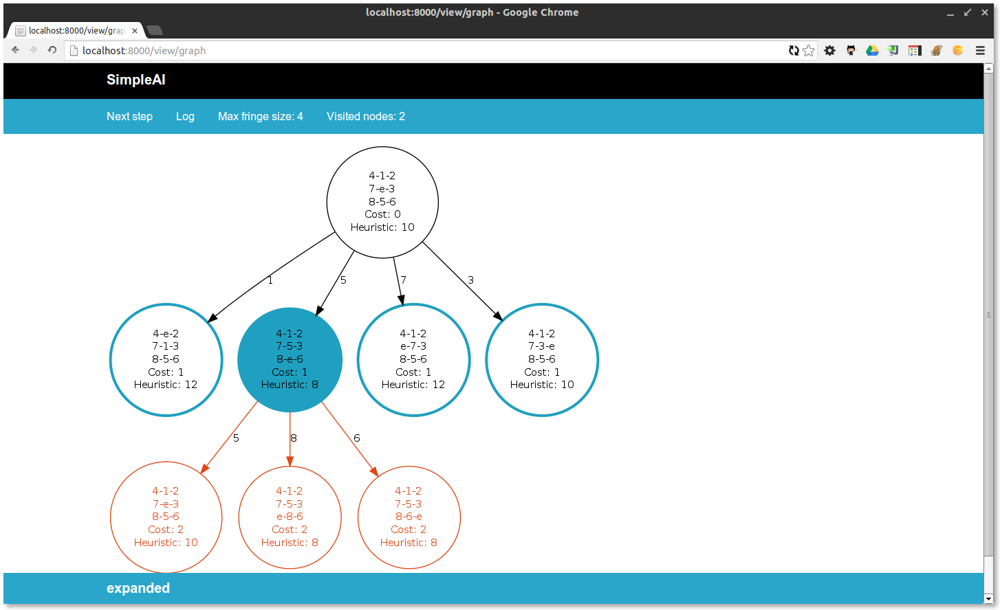

Search algorithms interactive viewers
=====================================

.. note::

    To use the viewers you need to have graphviz (on linux: ``sudo apt-get install graphviz``), and the following pip packages:
    ``pip install pydot flask`` (use ``sudo`` if on linux and not inside a virtualenv)

A common issue when solving search problems, is debugging the search
algorithms to find out why our problems aren't being solved as expected.

And most of the time this is somewhat frustrating, because the algorithms don't
follow a "linear" path of execution. They construct a tree, and walk this tree
by jumping and choosing specific nodes on each iteration. 
This makes harder to understand where we are while debugging function calls, 
because we don't have that tree in our minds. 
It becomes difficult to understand "where" the algorithm is at a given moment.

SimpleAI provides you with a tool to overcome that issue. A "map" for you to understand
where you are on the search tree at any moment. The **visual execution
viewers**.

How do they work? The basic idea is this: you attach a viewer to your algorithm 
call, and then you are able to follow the algorithm step by step, while looking 
at the search tree (and more useful information) in real time.

These viewers are meant to be used as a debugging tool, the may slow down the
algorithms a little. But are also useful to collect statistics during the
execution of the algorithms, like maximum size of the fringe, or number of
expanded nodes.

Basic usage
-----------

SimpleAI implements three execution viewers: the WebViewer, the ConsoleViewer
and the BaseViewer. From the code point of view, both viewers are used the same
way: you just need to give the search method an extra parameter called
"viewer".

Example:

.. code-block:: python

    from simpleai.search import breadth_first
    from simpleai.search.viewers import WebViewer

    # class HelloProblem..., my_problem = ... (steps from the previous sections about search problems)

    my_viewer = WebViewer()

    result = breadth_first(problem, viewer=my_viewer)

Once you run your program and the search algorithm is called with the attached
viewer, you will be able to interact with the execution on the way the viewer
implements it.

WebViewer
---------

The WebViewer will start a small website, and keep waiting for interactions
done on the website (this website runs locally, so don't worry, you don't need
an internet connection, and no data is being sent outside your computer. You
can check the WebViewer class code if you are suspicious).

When you run your program you will see a message indicating the web server is
up, and instructions on how to stop it if you don't want it anymore. Once the
server is up, to access the website open a web browser and navigate to `this
address <http://localhost:8000/>`_.

By default, you will see a welcome message, and you will be able to start
running the algorithm by clicking on the "Play" link. Once you click it, you
will see the search graph updating itself in real time! You can pause the
execution ("Pause" link), and also run step by step ("Step" link). Below the
graph you have useful information regarding the last event (the information box
is expanded when hovering with the mouse). 

For more detailed information, you can access a log of all the past events
clicking on the "Log" link. And also you can see statistics about the execution
with the "Stats" link.

More information about the viewer controls, and the graph reference, on the 
"Help" link.

The WebViewer can receive some configuration parameters (they are all optional,
if you don't understand them just leave them with their default values):

* **host** (string, optional, default to '0.0.0.0'): by default, the website
  will allow connections coming from any network address. If you want to
  restrict that, then you can specify the allowed address using this parameter.
* **port** (integer, optional, default to 8000): the port where the website
  will be listening.

Example usage:

.. code-block:: python

    from simpleai.search import breadth_first
    from simpleai.search.viewers import WebViewer

    # class HelloProblem..., my_problem = ... (steps from the previous sections about search problems)

    my_viewer = WebViewer()

    result = breadth_first(my_problem, viewer=my_viewer)

ConsoleViewer
-------------

The ConsoleViewer is similar to the WebViewer but instead of the web graphical
interface, it has a terminal based interface.  By default it will stop on each
event of the algorithm (new iteration, node expanded, ...), print some
information about the event, and wait for your input. You can just press enter
to continue to the next event or use any of the several commands available to
get information about the execution. You can generate a PNG file with the
current search tree, show statistics, and more. These commands are explained on
the interactive prompt shown when you run the algorithm using the
ConsoleViewer, so they won't be explained here.

You can also specify some configuration for the ConsoleViewer when creating it.
It allows one parameter:

* **interactive** (boolean, optional, default to True): You can disable all
  interactions and let the algorithm run until the end.

Example usage:

.. code-block:: python

    from simpleai.search import breadth_first
    from simpleai.search.viewers import ConsoleViewer

    # class HelloProblem..., my_problem = ... (steps from the previous sections about search problems)

    my_viewer = ConsoleViewer()

    result = breadth_first(my_problem, viewer=my_viewer)

BaseViewer
----------

This viewer is the base for the other two viewers, and is useful when you just
want to run the algorithm and collect statics and logs, without any kind of
interaction. It doesn't have a user interface, and won't stop until the
algorithm has finished.

Example usage:

.. code-block:: python

    from simpleai.search import breadth_first
    from simpleai.search.viewers import BaseViewer

    # class HelloProblem..., my_problem = ... (steps from the previous sections about search problems)

    my_viewer = BaseViewer()

    result = breadth_first(my_problem, viewer=my_viewer)

Statistics and Logs
-------------------

After running the algorithm, the viewer (Web, Console or Base) will have some
interesting statistics and logs, that may be useful to analyze:

* The maximum reached size of the fringe.
* The number of nodes that were visited.
* The number of iterations performed.
* A list of all the events ocurred during the algorithm execution. Each event
  is a tuple with the following structure: (event_name, event_description).

You can access those statistics and logs as attributes of the viewer instance,
after the algorithm finished, like this:

.. code-block:: python

    from simpleai.search import breadth_first
    from simpleai.search.viewers import BaseViewer

    # class HelloProblem..., my_problem = ... (steps from the previous sections about search problems)

    my_viewer = BaseViewer()

    result = breadth_first(my_problem, viewer=my_viewer)

    print 'Stats:'
    print my_viewer.stats

    print 'Events:'
    print my_viewer.events

Creating your own execution viewer
----------------------------------

You can also create your own execution viewer, for example if you want to debug
certain specific scenarios, or you want to generate extra statistics not
included on the current viewers. To do this, you must create a new class
inheritting from BaseViewer, and define a single method: 

* **event**: this method receives a name and a list of optional parameters
  called params. It doesn't needs to return anything, but is **really**
  important that you don't forget to call the original ``event`` method using
  the ``super`` function.

That method will be called each time the algorithm raises an event. The
``name`` parameter will receive the event name, and the ``params`` parameter
will receive a list of extra objects related to the event. These are the
possible events, and the extra information each one receives on ``params``:

+---------------+-------------------------------+----------------------------------+
| Event name    | Params                        | Description                      |
+===============+===============================+==================================+
| started       | []                            | Raised every time a new run      |
|               |                               | is made. For single run          |
|               |                               | algorithms, will be just one     |
|               |                               | time. For algorithms with        |
|               |                               | restarts or multiple runs,       |
|               |                               | will be one for each run.        |
|               |                               | Has no extra params.             |
+---------------+-------------------------------+----------------------------------+
| new_iteration | [fringe]                      | Raised on each new iteration     |
|               |                               | of the algorithm. The ``fringe`` |
|               |                               | param will contain the list      |
|               |                               | of nodes at the fringe when      |
|               |                               | the iteration begins.            |
+---------------+-------------------------------+----------------------------------+
| chosen_node   | [node, is_goal]               | Raised each time the             |
|               |                               | algorithm picks a node from      |
|               |                               | the fringe to be analyzed.       |
|               |                               | The ``node`` param contains the  |
|               |                               | chosen node, and the ``is_goal`` |
|               |                               | param is a boolean.              |
+---------------+-------------------------------+----------------------------------+
| expanded      | [nodes, successors]           | Raised each time a node or group |
|               |                               | of nodes must be expanded (their |
|               |                               | children are generated and added |
|               |                               | to the fringe). The ``nodes`` is |
|               |                               | a list of the expanded nodes,    |
|               |                               | and the ``successors`` param is  |
|               |                               | a list of lists, each one being  |
|               |                               | the list of children of one of   |
|               |                               | the expanded nodes.              |
+---------------+-------------------------------+----------------------------------+
| finished      | [fringe, node, solution_type] | Raised when each run of the      |
|               |                               | algorithm finishes (the same     |
|               |                               | logic as the started event).     |
|               |                               | The ``node`` param will          |
|               |                               | contain the returned node        |
|               |                               | or None when no solution was     |
|               |                               | found. The ``solution_type``     |
|               |                               | is a string describing the       |
|               |                               | kind of solution returned.       |
+---------------+-------------------------------+----------------------------------+

Also, if you need to include code on the initializer of your class
(``__init__`` method), don't forget to call the original ``__init__`` using the
``super`` function.

Example of custom viewer:

.. code-block:: python

    from simpleai.search.viewers import BaseViewer

    class MyOwnViewer(BaseViewer):
        def __init__(self):
            super(MyOwnViewer, self).__init__()
            self.stats['iterations_with_lots_of_nodes'] = 0

        def event(self, name, *params):
            super(MyOwnViewer, self).event(name, *params)
            if name == 'new_iteration':
                fringe = params[0]
                if len(fringe) > 100:
                    self.stats['iterations_with_lots_of_nodes'] += 1
                    print 'Wow! an iteration with more than 100 nodes on the fringe!'
